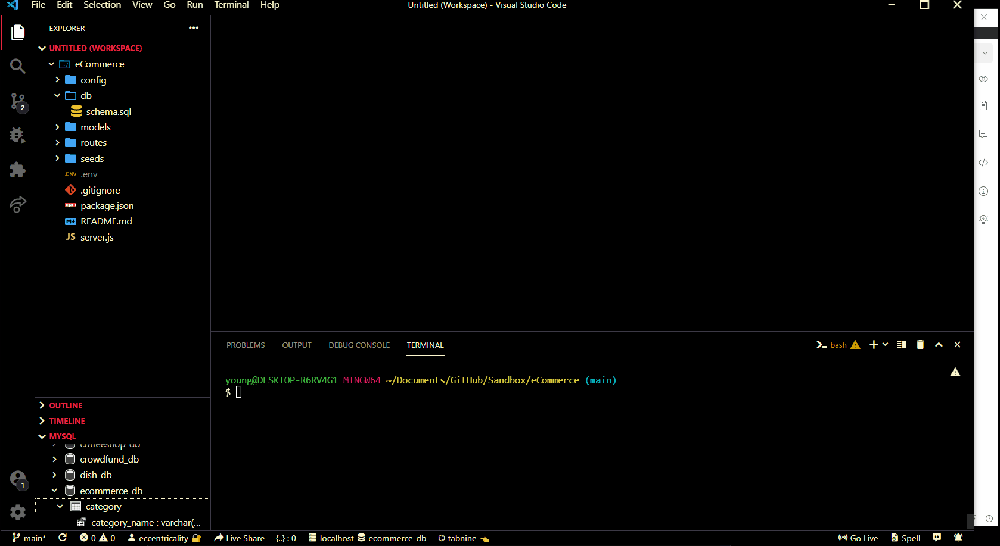

# eCommerce Backend

User is utilize Postman or equivalent to view api routes for products in an eCommerce like app. User can view all products or individual products by product id. User is able to add a product of their own with ids labeled for proper categorization. User is able to delete records from products.
## Demo


## Installation

Install node modules via "npm i".
Update .env variables as according to your own log in.
Run the schema as shown in the gif.
Run the script to seed as shown in the gif.

```bash
  npm run seed
```
    
Run the script to start server as shown in the gif.

```bash
  npm start
```
## Lessons Learned

This was a fairly straightforward homework, much easier to handle at this point in the course. Backend utilization of models routes and api is always fun for me personally and I look forward to continued practice and implementation in real life situations.